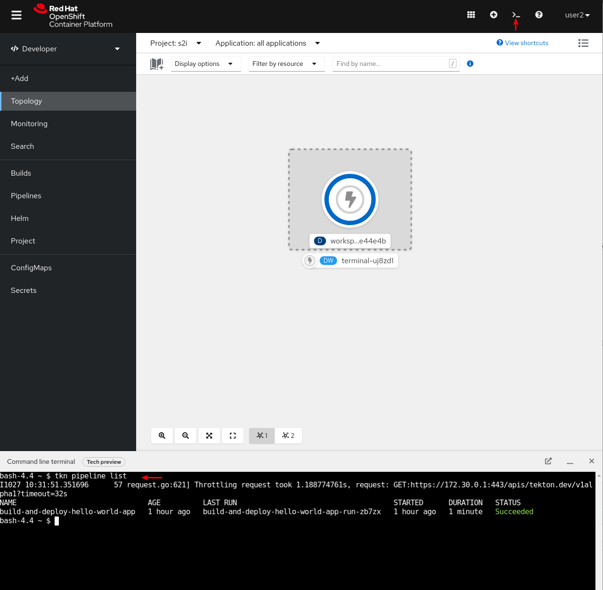
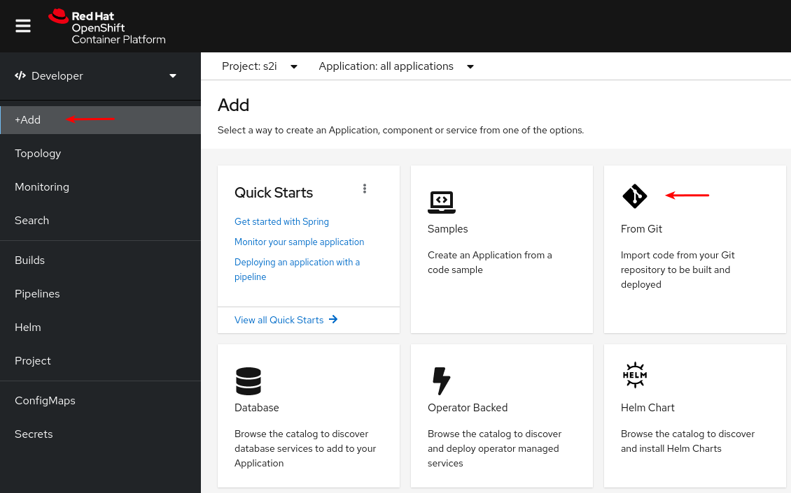
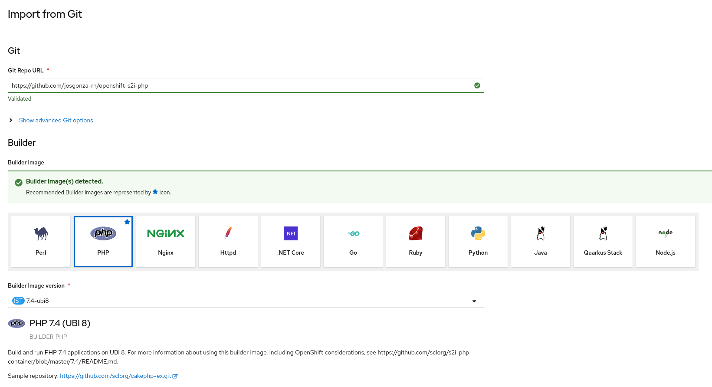
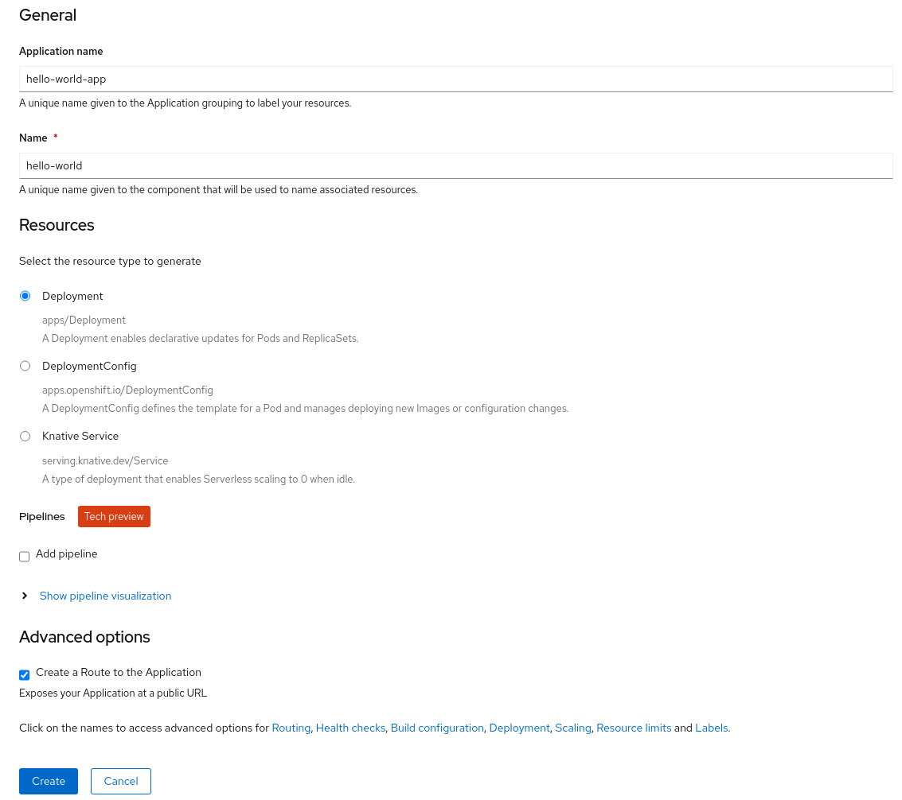
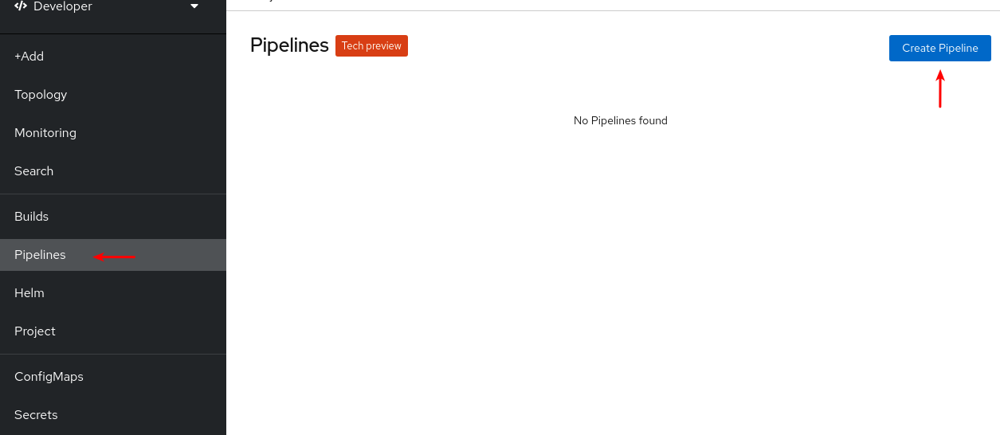
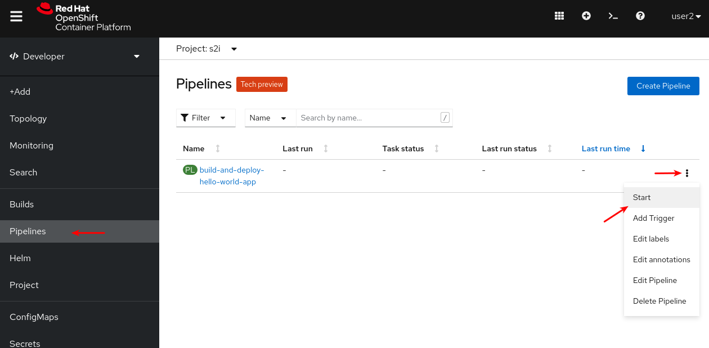
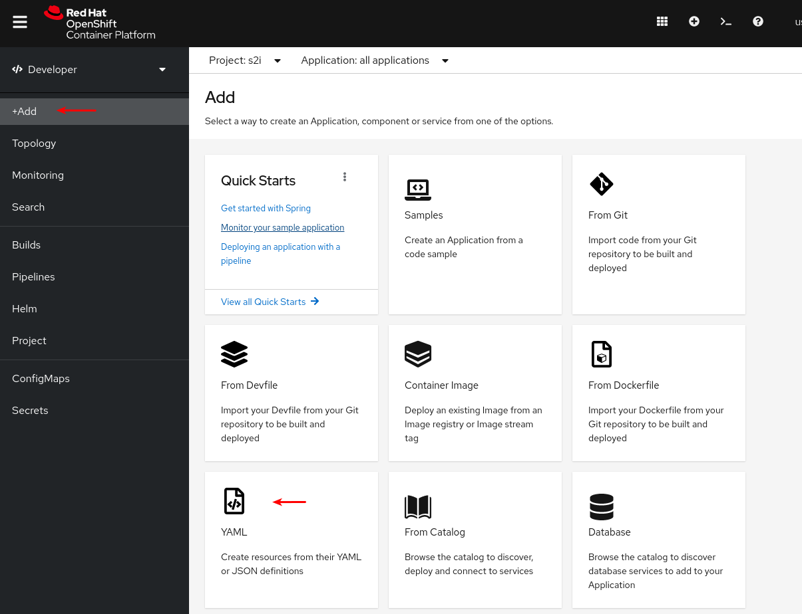
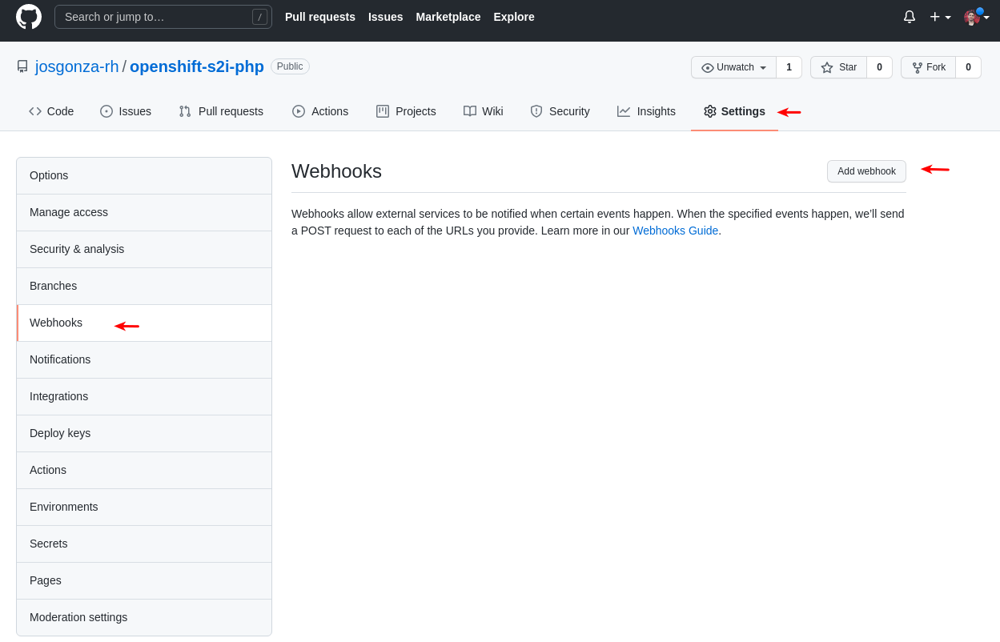
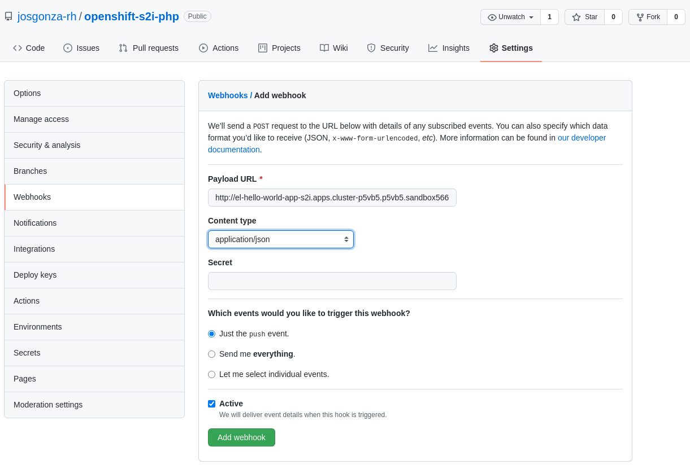

# openshift-s2i-php
PHP Hello World Demo page for Red Hat OpenShift S2I

## Prerequisites

* You have access to an OpenShift Container Platform cluster.

* You have installed OpenShift Pipelines using the Red Hat OpenShift Pipelines Operator listed in the OpenShift OperatorHub. Once installed, it is applicable to the entire cluster.

* You have installed OpenShift Pipelines CLI (or use the terminal offered by the `Web Terminal` operator)

  

* (Optional) You have forked this Git repository using your GitHub ID, and have administrator access to that repository (just for testing the Webhook part)

## Step-by-step guide

### Initial deployment

1. Create the project with the web console or from command line, ex. `s2i`:

    ```bash
    oc new-project s2i
    ```

2. Deploy the initial app:

    * Using web consle ( `+Add` -> `From Git` ) with this repo: https://github.com/josgonza-rh/openshift-s2i-php

      

      

      

      >  **WARNING**: `Name` is crucial here. You **must** set it to as **hello-world** as you can see in the sreenshot. If you want to change the `Name` to another value, you should change the `deployment-name` value in for the [TriggerTemplate](cicd/resources/02-triggers/hello-world-trigger.yaml).

    * From command line:

        ```bash
        oc new-app php:7.4~https://github.com/josgonza-rh/openshift-s2i-php --name=hello-world
        ```

3. Create Pipeline

    * Using web consle ( `+Add` -> `YAML` ) or the Pipeline menu:

      

    * From command line:

        ```bash
        oc create -f https://raw.githubusercontent.com/josgonza-rh/openshift-s2i-php/main/cicd/resources/01-pipelines/hello-world-pipeline.yaml
        ```

4. Running the Pipeline

    * Using web consle ( `Pipeline` -> `Start` )

      

    * From command line:

        ```bash
        tkn pipeline start build-and-deploy-hello-world-app -w name=workspace,volumeClaimTemplateFile=https://raw.githubusercontent.com/josgonza-rh/openshift-s2i-php/main/cicd/resources/00-worspaces/hello-world-workspace.yaml -p GIT_REPO=https://github.com/josgonza-rh/openshift-s2i-php

        ```
    >  **NOTE**: A `PipelineRun` resource starts a pipeline and ties it to the Git and image resources that should be used for the specific invocation. It automatically creates and starts the `TaskRun` resources for each task in the pipeline.

### Triggers and Webhook

Triggers enable pipelines to respond to external GitHub events, such as push events and pull requests. After you assemble and start a pipeline for the application, add the `TriggerBinding`, `TriggerTemplate`, `Trigger`, and `EventListener` resources to capture the GitHub events.

1. Adding triggers to the pipeline

    * Using web consle ( `+Add` -> `YAML` )

      

    * From command line:

        ```bash
        oc create -f https://raw.githubusercontent.com/josgonza-rh/openshift-s2i-php/main/cicd/resources/02-triggers/hello-world-trigger.yaml
        ```

2. Expose the `EventListener` service as an OpenShift Container Platform route to make it publicly accessible:

    ```bash
    oc expose svc el-hello-world-app
    ```

>  **NOTE**: Adding webhooks requires administrative privileges to the repository. If you do not have administrative access to your repository, contact your system administrator for adding webhooks.

1. Get the webhook URL:

    ```bash
    echo "URL: $(oc  get route el-hello-world-app --template='http://{{.spec.host}}')"
    ```

2. Configure webhook manually on your repository:

    * Open the repositoryin your browser.
    * Click **Settings** → **Webhooks** → **Add Webhook**

        

    * On the Webhooks/Add Webhook page:
        * Enter the webhook URL from step 1 in Payload URL field
        * Select **application/json** for the Content type
        * Ensure that the **Just the push event** is selected
        * Select **Active**
        * Click **Add Webhook**

      